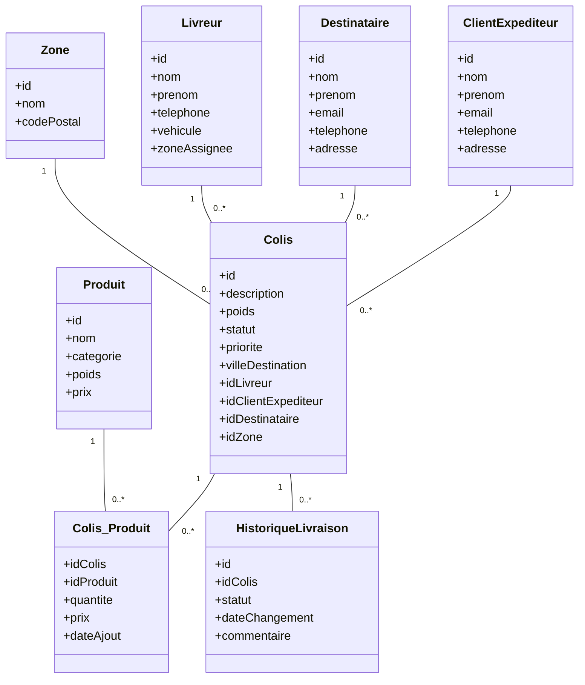

# Smart Delivery Management System (SDMS)

## Présentation

**SmartLogi** est une société spécialisée dans la livraison de colis à travers le Maroc.  
Le **Smart Delivery Management System (SDMS)** modernise et automatise la gestion logistique en centralisant les opérations, optimisant la planification et garantissant une traçabilité complète.

Fini les erreurs et la gestion manuelle sur Excel ou papier : avec **SDMS**, l’organisation devient **fiable, efficace et évolutive**.

---

## Objectifs

- Centraliser la gestion des clients expéditeurs, destinataires, colis, livreurs et zones de livraison.
- Suivre le flux complet des colis : collecte, stockage, planification, livraison.
- Recherche et suivi précis des colis par ville, zone, statut et priorité.
- Historique complet et traçabilité de chaque colis.
- Optimisation des tournées et réduction des retards.
- Aide à la décision pour les gestionnaires logistiques.

---

## Utilisateurs clés

- **Gestionnaire logistique** : supervise, planifie et gère les livreurs et le stock.
- **Livreur** : consulte ses colis assignés et met à jour leurs statuts.
- **Client expéditeur** : crée des demandes et suit ses colis.
- **Destinataire** : consulte le statut et la livraison de ses colis.

---

## Modèle métier principal

### Diagramme de classes

